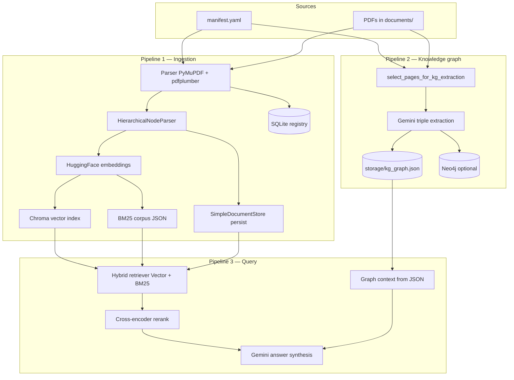
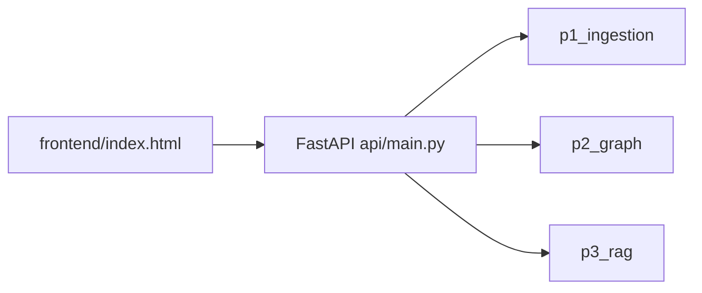
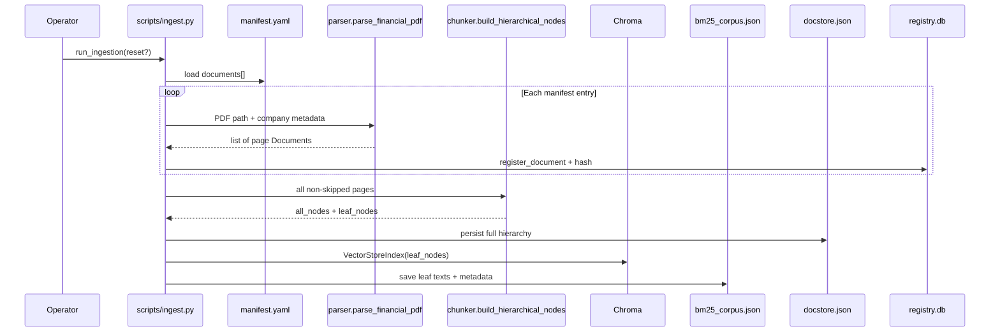
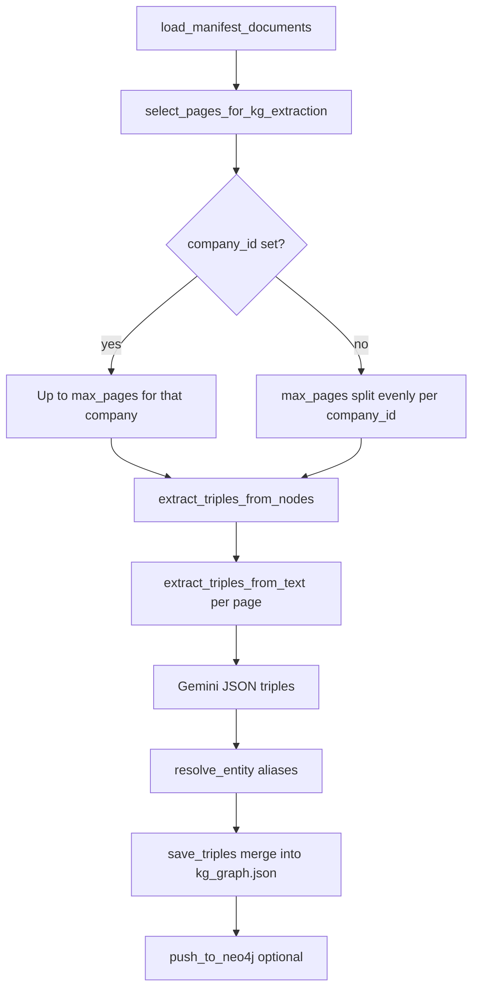
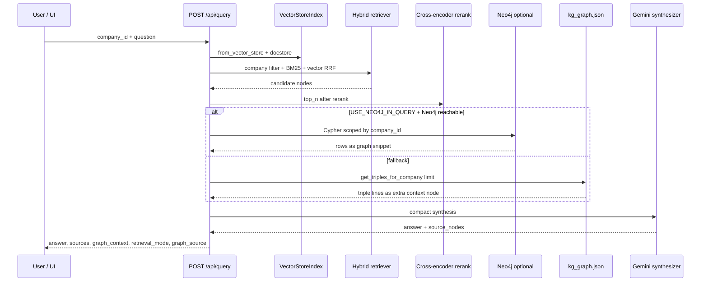
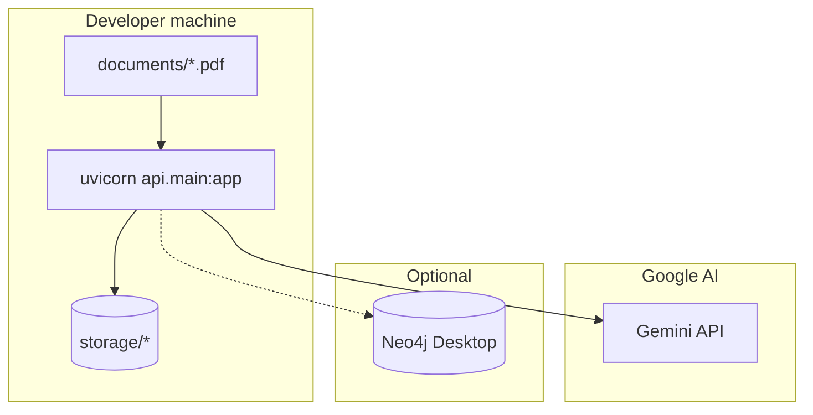

# InsightOS POC 2 — Technical Reference

This document explains architecture, data flow, and runtime behavior. It complements `insightos_system_design.md` (target enterprise design) with **what this repository actually implements today**.

---

## Quick answers

### How long does **KG extraction (all companies)** take?

Rough guide (network + Gemini latency dominates):

| Phase | What happens | Order of magnitude |
|--------|----------------|-------------------|
| **Balanced page pick** | e.g. `max_pages=120`, 3 companies → ~40 pages each | Instant (local) |
| **LLM calls** | **One `generateContent` call per selected page** | ~15–45 s per page typical |
| **Total** | 120 pages × ~25 s average | **~50–90+ minutes** |

If you lower `max_pages` (e.g. 30 → ~10 pages per company), time scales down roughly linearly.

### What is **`max_pages`**?

- It is **not** “pages of the PDF” in the abstract; it is the **maximum number of page-level documents** the KG pipeline will send to the LLM.
- Each manifest PDF is loaded as **one `Document` per physical page** (with metadata: `company_id`, `source_file`, `page_label`, etc.).
- **`company_id` omitted (all companies):** `max_pages` is a **total budget** split **evenly** across distinct `company_id` values in the manifest (e.g. 120 ÷ 3 ≈ 40 pages per issuer).
- **`company_id` set (one company):** up to `max_pages` pages for **that** company only.

Configured in the API (`KGExtractRequest.max_pages`), the Actions UI (e.g. 120 / 50), or `scripts/extract_kg.py --max-pages`.

### Do I need to **ingest**?

| Goal | Ingest required? |
|------|------------------|
| **Chat / RAG** (`/api/query`, answers with sources) | **Yes.** Ingest builds **Chroma** vectors, **BM25** corpus, and **docstore** under `storage/`. |
| **Knowledge graph file** (`storage/kg_graph.json`) | **No** for *reading* old JSON; **yes** you need **parsed page text** — either re-parse via the same code path as ingest, or rely on `load_manifest_documents` which **reads PDFs from disk** (same parser as ingestion). The **Extract KG** API loads PDFs via the parser; it does **not** require Chroma to exist, but PDFs must be on disk and listed in `manifest.yaml`. |
| **Neo4j** | **No** ingest. Import triples from JSON with `scripts/load_kg_json_to_neo4j.py` after extract. |

**Practical order for a full demo:** **Ingest → Extract KG (all companies) → optional Neo4j load → run API.**

---

## High-level architecture

---

## Component map

| Area | Path | Role |
|------|------|------|
| Config | `config/settings.py` | Env: LLM, embeddings, Chroma collection, chunk sizes, Neo4j URL |
| Ingestion | `pipelines/p1_ingestion/` | Parse, chunk, index, registry |
| Graph | `pipelines/p2_graph/` | Schema, extract, JSON store, Neo4j import |
| RAG | `pipelines/p3_rag/` | Retriever, reranker, query engine, workflow |
| API | `api/` | REST + static UI mount |
| Scripts | `scripts/` | `ingest.py`, `extract_kg.py`, `load_kg_json_to_neo4j.py` |

---

## Data flow: ingestion (step by step)

1. **Read `manifest.yaml`** — each row: `path`, `company_id`, `company_name`, `doc_type`, etc.
2. **Resolve PDF path** under project `ROOT`.
3. **Optional skip** — if `content_hash` already in registry and not `--reset`, skip file.
4. **Parse** — For each page: PyMuPDF text + pdfplumber tables → Markdown; metadata includes `page_label`, `source_file`, `company_id`. Low-text pages may be tagged `figure_skipped` (still logged; typically excluded from indexing batch).
5. **Register** — SQLite `document_registry` row per file.
6. **Chunk** — `HierarchicalNodeParser` with sizes from env (default `2048,512,128`); **leaf** nodes carry embeddings.
7. **Docstore** — All hierarchy levels saved to `storage/docstore.json` (for future AutoMerging-style use).
8. **Vector index** — Leaf nodes embedded (HuggingFace) and written to **Chroma** `storage/chroma/`.
9. **BM25** — Same leaf texts + `company_id` / file / page → `storage/bm25_corpus.json`.
10. **Registry status** — Updated to `p1_done` with chunk counts.

**Artifacts**

| Artifact | Purpose |
|----------|---------|
| `storage/chroma/` | Semantic retrieval |
| `storage/bm25_corpus.json` | Keyword leg of hybrid search |
| `storage/docstore.json` | Hierarchical node storage |
| `storage/registry.db` | Document tracking |

---

## Data flow: knowledge graph extraction (step by step)

1. **Load pages** — Same PDF → page `Document` list as ingestion (no requirement that Chroma exists).
2. **Select pages** — `select_pages_for_kg_extraction` applies **balanced multi-company** or **single-company** cap; drops `figure_skipped`.
3. **Per page** — Prompt asks Gemini for JSON array of `{subject, subject_type, relation, object, object_type, properties}` constrained by financial schema text in prompt.
4. **Normalize** — `resolve_entity` maps aliases (e.g. HZL → canonical id).
5. **Persist** — Append triples and aggregate `nodes` / `edges` in `storage/kg_graph.json` (`merge=True` keeps prior triples).
6. **Neo4j** — If `NEO4J_PASSWORD` set and driver installed, `neo4j_import` upserts `:InsightEntity` and typed relationships; else skip.

**Separate path:** `scripts/load_kg_json_to_neo4j.py` loads **existing** JSON without calling Gemini.

---

## Data flow: query (RAG + optional graph context)

1. **Load index** — Chroma + optional docstore from disk.
2. **Retrieve** — `MetadataFilter` on `company_id`; BM25 leg uses `bm25_corpus.json` rows for same company; **RRF** fusion.
3. **Rerank** — Sentence-transformers cross-encoder; keep top N.
4. **Graph context** — If `USE_NEO4J_IN_QUERY` is set and Neo4j is reachable, runs a **read-only** Cypher query (default template on `(:InsightEntity)-[r]->(:InsightEntity)` with `r.company_id`; optional `NEO4J_TEXT_TO_CYPHER=1` for LLM-proposed Cypher after validation). Otherwise reads triples from **`kg_graph.json`** for that `company_id`. The response includes **`graph_source`** (`neo4j_template`, `neo4j_llm`, or `json_file`).
5. **Synthesize** — Gemini `compact` mode over nodes + graph snippet.
6. **Response** — Answer text + per-source file / page / passage + optional `graph_context` list.

---

## API surface (summary)

| Method | Path | Pipeline |
|--------|------|----------|
| POST | `/api/ingest` | P1 |
| POST | `/api/kg/extract` | P2 |
| POST | `/api/query` | P3 |
| GET | `/api/kg/graph/{company_id}` | Subgraph from JSON for UI graph |
| GET | `/api/health` | Chroma / BM25 / docstore / KG file flags + `neo4j_reachable` |

---

## Design vs this POC

| Topic | Design doc (`insightos_system_design.md`) | This repo |
|-------|----------------------------------------|-----------|
| Vector DB | Qdrant | **Chroma** (Python 3.14 + current LlamaIndex compatibility) |
| Registry | PostgreSQL example | **SQLite** `storage/registry.db` |
| KG store | Neo4j primary | **JSON file** + optional Neo4j import |
| Orchestration | Prefect mentioned | **Scripts + FastAPI** triggers |

---

## Mermaid: deployment view (local)

---

## Related files

- `insightos_system_design.md` — Target multi-pipeline architecture and scaling notes.
- `README.md` — Quick start and commands.
- `manifest.yaml` — Document list and `company_id` binding.
- `.env.example` — Environment variables.

---

*Generated for InsightOS `llamaIndexPOC_2`; align with code when in doubt.*
